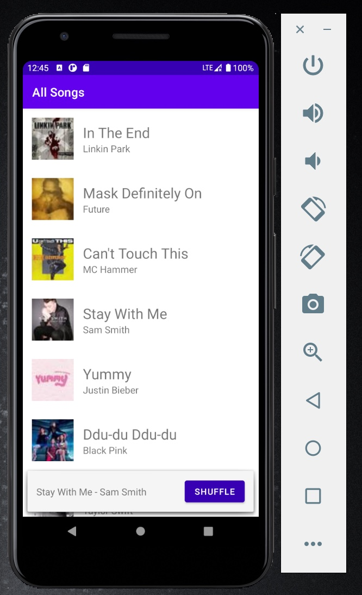
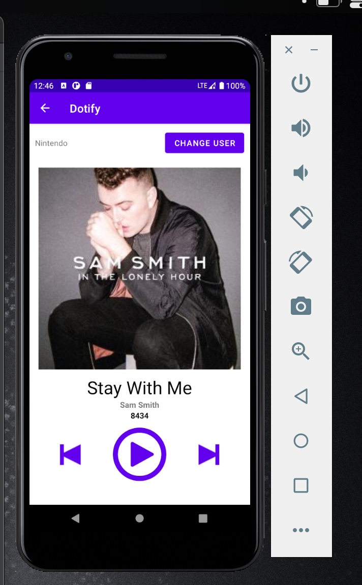

# INFO 448 Homework 2 - Activities & RecyclerView
## Leo Kwo
**Description**
This app is a mockup music player. It randomlly generates a number of songs played in the beginning which adds one every time the user clicks on the play button. It also responds to the user's button presses and text entry.

In homework 2, I implemented a list of all the songs in the playlist that can respond to user's touch input and can shuffle itself when user clicks the shuffle button.

**Extra credit attempted**
- Show a stock Android back arrow button, ←, in the Header/Toolbar of Activity B. When clicked, it should navigate back to SongListActivity
- When a user presses shuffle, the list should animate the changes using DiffUtil

**Running in the emulator...**

