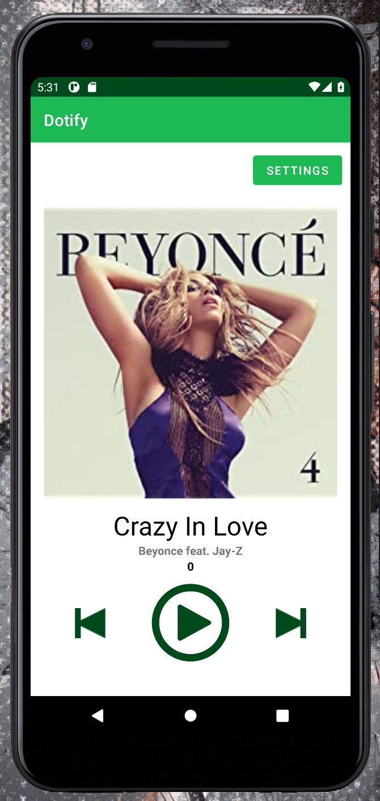

# INFO 448 Homework 5 - Application, JSON parsing & Network Requests
## Leo Kwo
**Description**
This app is a mockup music player. It randomlly generates a number of songs played in the beginning which adds one every time the user clicks on the play button. It also responds to the user's button presses and text entry.

In homework 2, I implemented a list of all the songs in the playlist that can respond to user's touch input and can shuffle itself when user clicks the shuffle button.

In homework 3, I implemented landscape views for the player and the list of songs screens. I also added a settings page where the users can access information about the current user, the song statistics, and app information.

In homework 4, I added the ability to store and retrieve data from the Application object. The app is now also capabale of fetching and parsing json from the internet. The songlistactivity also now supports swipe to refresh.

In homework 5, I added the functionality to toggle on and off Notification for new songs. When toggled on, the app will push a new notification that tells the user that a new song is released by some artist. When the user clicks on the notification, the app will open up the player.

**Extra credit attempted**
- FOR DOTIFY project ONLY: In requirement 2.b.v.2, tapping the notification should launch PlayerActivity that passes the song data to the activity to show the song in the player (+1)

**Running in the emulator**
Settings Page:

Notification Turned On:

First Notification:

After Clicking on the Notification:

2nd Notification (after ~20 min):

**May need to build several times before the app can run properly...**
