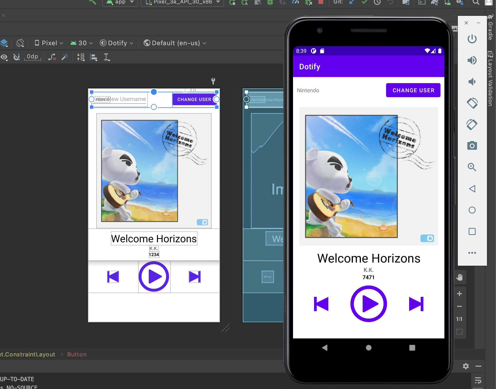

# INFO 448 Homework 1 Layouts, Widgets, Event Handling
## Leo Kwo
**Description**
This app is a mockup music player. It randomlly generates a number of songs played in the beginning which adds one every time the user clicks on the play button. It also responds to the user's button presses and text entry.

**Extra credit attempted**
- A user is not allowed to apply a new username if the edit text field is empty.
- Long pressing on the cover image changes the text color of the play count to a different color.

**Running in the emulator...**

